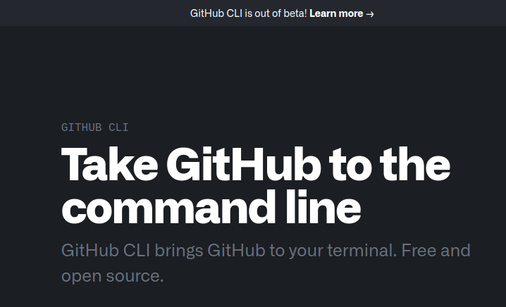
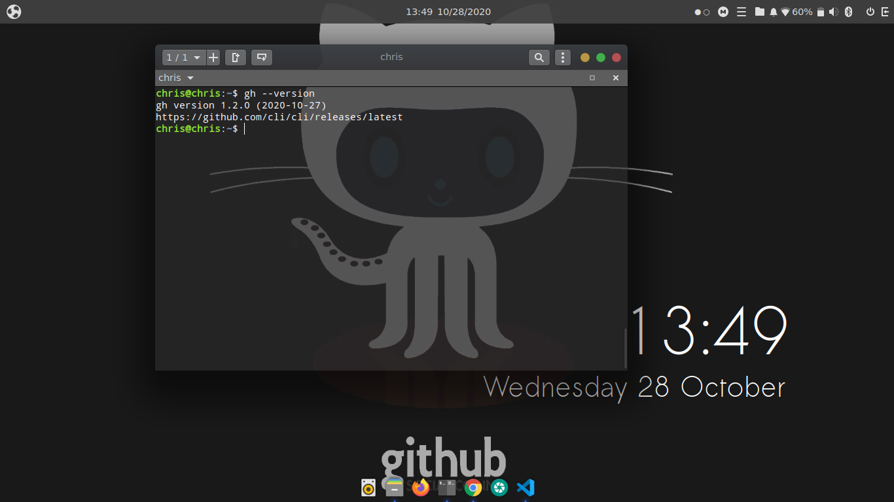
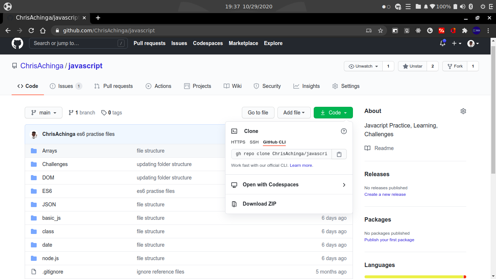

# Pilot

[GitHub CLI](https://cli.github.com/) beta version was released a while ago, and it comes with really cool features. I have been using and interacting with GitHub without necessarily visiting the webiste, that's fun right.

An alternative to using GitHub CLI is [HUB](https://hub.github.com/), which was there before GitHub cli was introduced.

GitHub CLI is an open-source project, here on [GitHub](https://github.com/cli/cli/).

I had an article before on using GitHub CLI and its commands, so this is kind of like an update because the cli is up on version 1.x.x right now, better to stay on the know/updated. To get the latest releases of the cli <https://github.com/cli/cli/releases>

Everything you need to know about the cli is on their site, <https://cli.github.com/>

# Installation

[GitHub CLI](https://cli.github.com/) has to be installed on your device for you to use it.

View installation procedures based on your operating system:

[Installing GitHub CLI](https://github.com/cli/cli#installation)

# Usage

With the cli, you can create repositories, pull requests, issues, clone repos, and much more.

 If I were to write on every usage gh cli has to offer, this would have been one of the longest and probably most boring technical articles, so I'll break them down and make a mini-article-series if that makes sense.

# `gh repo clone`

This is one of the commands GitHub cli comes with. The gh clone works in a similar way as the popular git command, git clone.

Note that git and GitHub cli are two different things, but the gh clone and git clone perform a similar function altogether, and have a similar syntax.

to use the command, browse into your favorite GitHub project and clone it using GitHub cli, easy and fun.

For me, I'll go to one of my repos, https://github.com/ChrisAchinga/javascript.
click on the green button code, a dropdown appears, click on the Github CLI tab and copy the command;
`gh repo clone ChrisAchinga/javascript`

Simple as that and you are done.

A simple start to becoming a GitHub cli master!